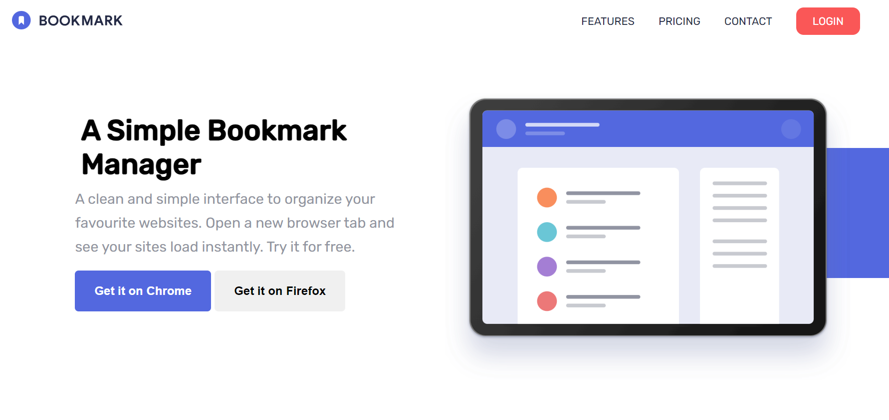

# Frontend Mentor - Bookmark landing page solution

This is a solution to the [Bookmark landing page challenge on Frontend Mentor](https://www.frontendmentor.io/challenges/bookmark-landing-page-5d0b588a9edda32581d29158). Frontend Mentor gives frontend challenges where users build realistic projects solely based on the images provided.

## Table of contents

- [Overview](#overview)
  - [The challenge](#the-challenge)
  - [Screenshot](#screenshot)
  - [Links](#links)
- [My process](#my-process)
  - [Built with](#built-with)
  - [What I learned](#what-i-learned)
- [Author](#author)

## Overview

### The challenge

Users should be able to:

- View the optimal layout for the site depending on their device's screen size
- See hover states for all interactive elements on the page
- Receive an error message when the newsletter form is submitted if:
  - The input field is empty
  - The email address is not formatted correctly

### Screenshot

### Links

- [Solution URL](https://www.frontendmentor.io/solutions/bookmark-landing-page-ix1QYeOUIB)
- [Live Site URL](https://app.netlify.com/sites/bookmark-landing-page-femk/overview)

## My process

### Built with

- Semantic HTML5 markup
- CSS custom properties
- Flexbox
- Mobile-first workflow
- Vanilla JS

### What I learned

This project has allowed me to really focus on refactoring the Javascript. On the one hand I sought to remove heavy HTML markdown by bringing iterable content to the Javascript, to imitate a React component, and on the other I broke down larger functions such as the email verification function int smaller function to improve readability.

With almost a thousand line of CSS for a fairly simple landing page, this project showed me how time-saving CSS frameworks can be.

I am especially interested in continuing to improve the scalability of my projects across difference screen sizes as this proved more time-consuming than expected.

## Author

- Website - [Kangkm] - Upcoming
- Frontend Mentor - [@KangFennex](https://www.frontendmentor.io/profile/KangFennex)
